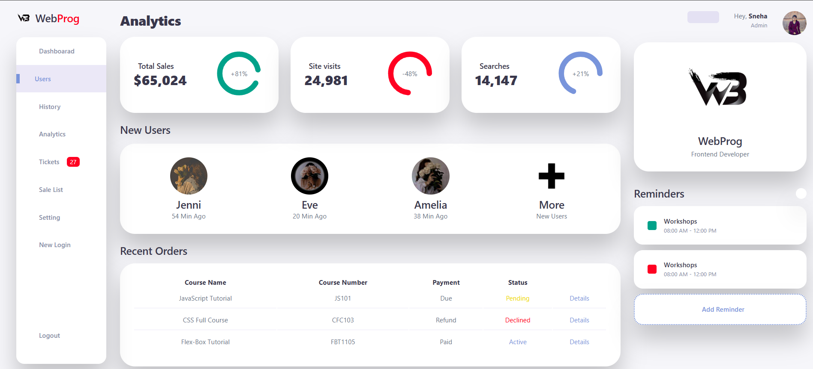

<h1>WebProg Admin Dashboard UI</h1>

A professional, responsive, and aesthetically pleasing Administrative Dashboard interface designed for managing e-learning platforms or digital storefronts.

<h3>Feature</h3>
<ol>
  <li>High-level cards displaying Total Sales, Site Visits, and Searches with integrated percentage growth indicators.</li>
  <li>A "New Users" section featuring profile avatars and activity timestamps.</li>
  <li>A "Recent Orders" table with status labels (Pending, Declined, Active) and detailed payment info.</li>
  <li>A dedicated widget for scheduling and viewing upcoming workshops or tasks.</li>
</ol>

